---
## Front matter
title: "Отчёт по лабораторной работе 7"
subtitle: "Архитектура компьютеров и операционные системы"
author: "Горелашвили Лия Михайловна НКАбд-03-23"

## Generic otions
lang: ru-RU
toc-title: "Содержание"

## Bibliography
bibliography: bib/cite.bib
csl: pandoc/csl/gost-r-7-0-5-2008-numeric.csl

## Pdf output format
toc: true # Table of contents
toc-depth: 2
lof: true # List of figures
lot: true # List of tables
fontsize: 12pt
linestretch: 1.5
papersize: a4
documentclass: scrreprt
## I18n polyglossia
polyglossia-lang:
  name: russian
  options:
	- spelling=modern
	- babelshorthands=true
polyglossia-otherlangs:
  name: english
## I18n babel
babel-lang: russian
babel-otherlangs: english
## Fonts
mainfont: PT Serif
romanfont: PT Serif
sansfont: PT Sans
monofont: PT Mono
mainfontoptions: Ligatures=TeX
romanfontoptions: Ligatures=TeX
sansfontoptions: Ligatures=TeX,Scale=MatchLowercase
monofontoptions: Scale=MatchLowercase,Scale=0.9
## Biblatex
biblatex: true
biblio-style: "gost-numeric"
biblatexoptions:
  - parentracker=true
  - backend=biber
  - hyperref=auto
  - language=auto
  - autolang=other*
  - citestyle=gost-numeric
## Pandoc-crossref LaTeX customization
figureTitle: "Рис."
tableTitle: "Таблица"
listingTitle: "Листинг"
lofTitle: "Список иллюстраций"
lotTitle: "Список таблиц"
lolTitle: "Листинги"
## Misc options
indent: true
header-includes:
  - \usepackage{indentfirst}
  - \usepackage{float} # keep figures where there are in the text
  - \floatplacement{figure}{H} # keep figures where there are in the text
---

# Цель работы

Целью работы является изучение команд условного и безусловного переходов. Приобретение навыков написания программ с использованием переходов. Знакомство с назначением и структурой файла листинга.

# Задание

1. Изучение команд условного и бкзусловного перехода

2. Изучение файла листинга

3. Выполнение заданий, рассмотрение примеров

5. Выполнение заданий для самостоятельной работы

# Теоретическое введение

Для реализации ветвлений в ассемблере используются так называемые команды передачи
управления или команды перехода. Можно выделить 2 типа переходов:

- условный переход – выполнение или не выполнение перехода в определенную точку программы в зависимости от проверки условия.

- безусловный переход – выполнение передачи управления в определенную точку программы без каких-либо условий.

Безусловный переход выполняется инструкцией jmp (от англ. jump – прыжок), которая
включает в себя адрес перехода, куда следует передать управление

Инструкция cmp является одной из инструкций, которая позволяет сравнить операнды и
выставляет флаги в зависимости от результата сравнения.
Инструкция cmp является командой сравнения двух операндов и имеет такой же формат,
как и команда вычитания

Команда условного перехода имеет вид

```j<мнемоника перехода> label```

Мнемоника перехода связана со значением анализируемых флагов или со способом формирования этих флагов.

# Выполнение лабораторной работы

## Реализация переходов в NASM

Создала каталог для программ лабораторной работы No7 и файл с названием 
"lab7-1.asm". Инструкция jmp в NASM используется для безусловных переходов. 

Давайте рассмотрим пример программы с использованием jmp. 
Написала текст программы из листинга 7.1 в файле "lab7-1.asm".  

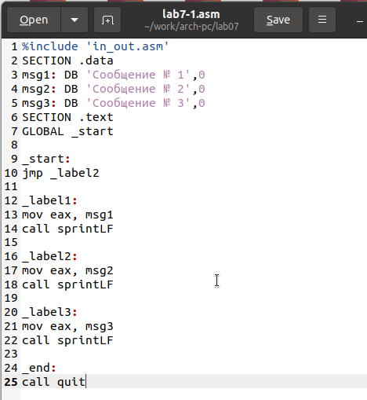{ #fig:001 width=70%, height=70% }

Затем создала исполняемый файл и запустила его.

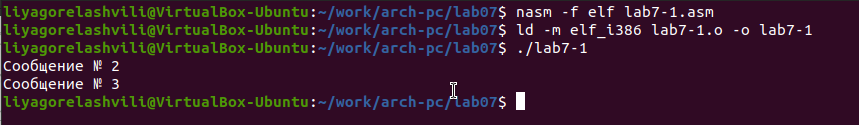{ #fig:002 width=70%, height=70% }

Инструкция jmp позволяет осуществлять переходы не только вперед, но и назад. 
Изменила программу так, чтобы сначала выводилось "Сообщение No2", 
потом "Сообщение No1", а затем происходил выход. 
Для этого после вывода "Сообщения No2" добавила инструкцию jmp с меткой 
"_label1" (переход к выводу "Сообщения No1"). 
А после вывода "Сообщения No1" добавила инструкцию jmp с меткой "_end" 
(переход к инструкции call quit). Изменила текст программы в соответствии 
с листингом 7.2.

Изменила текст программы в соответствии с листингом 7.2.

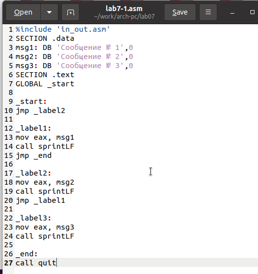{ #fig:003 width=70%, height=70% }

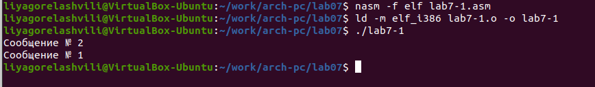{ #fig:004 width=70%, height=70% }

Изменила текст программы, изменив инструкции jmp, чтобы вывод программы был следующим:
```
Сообщение № 3
Сообщение № 2
Сообщение № 1
```

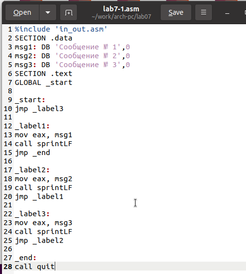{ #fig:005 width=70%, height=70% }

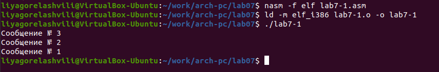{ #fig:006 width=70%, height=70% }

Использование инструкции jmp приводит к переходу в любом случае. 
Однако, часто при написании программ необходимо использовать условные переходы, 
то есть переход должен происходить, если выполнено какое-либо условие. 

Я рассмотрела программу, которая определяет и выводит наибольшее из трех чисел: 
A, B и C. Значения для A и C задаются в коде, а значение B вводится с клавиатуры.

Создала исполняемый файл и проверила его работу для разных значений B.

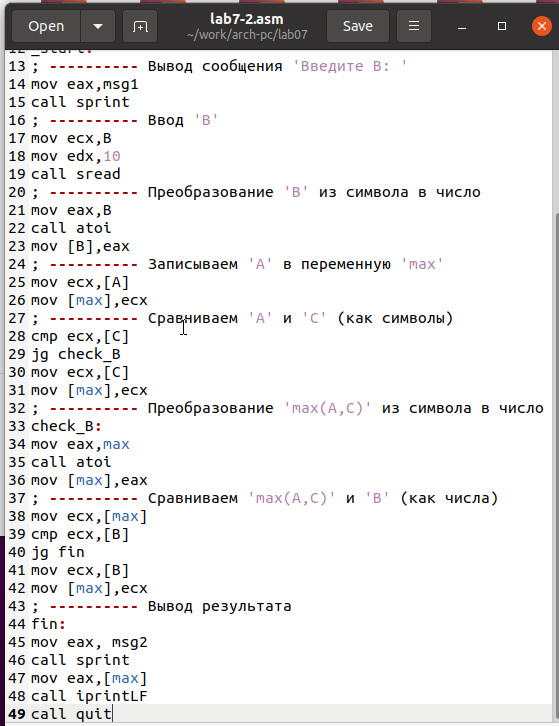{ #fig:007 width=70%, height=70% }

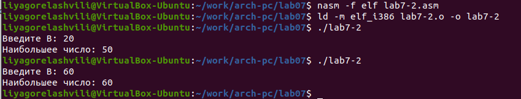{ #fig:008 width=70%, height=70% }

## Изучение структуры файлы листинга

Обычно nasm создаёт только объектный файл после ассемблирования. 
Чтобы получить файл листинга, нужно указать ключ -l и задать имя файла листинга 
в командной строке. 

Я создала файл листинга для программы из lab7-2.asm.

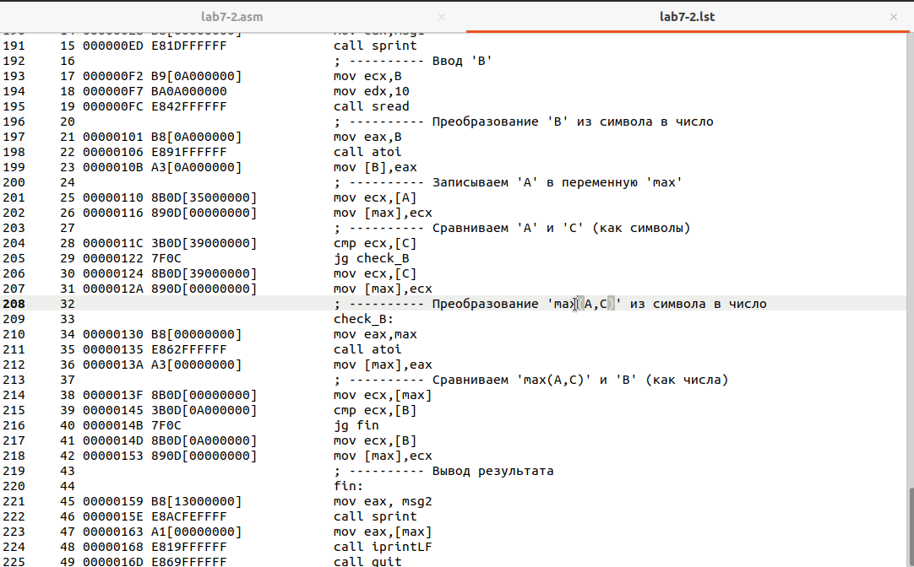{ #fig:009 width=70%, height=70% }

Внимательно ознакомилась с его форматом и содержимым. 
Подробно объясню содержимое трёх строк этого листинга.

*строка 209*

- 34 - номер строки в подпрограмме

- 00000130 - адрес

- B8[00000000] - машинный код

- mov eax,max - код программы - копирует max в eax

*строка 210*

- 35 - номер строки в подпрограмме

- 00000135 - адрес

- E862FFFFFF - машинный код

- call atoi - код программы - вызов подпрограммы atoi

*строка 211*

- 36 - номер строки в подпрограмме

- 0000013A - адрес

- A3[00000000] - машинный код

- mov [max],eax - код программы - копирует eax в max

Открыла файл с программой lab7-2.asm и в инструкции с двумя операндами удалила один операнд. 
Выполнила трансляцию с получением файла листинга.

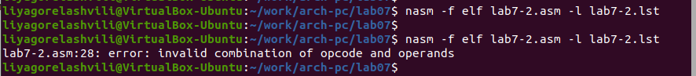{ #fig:010 width=70%, height=70% }

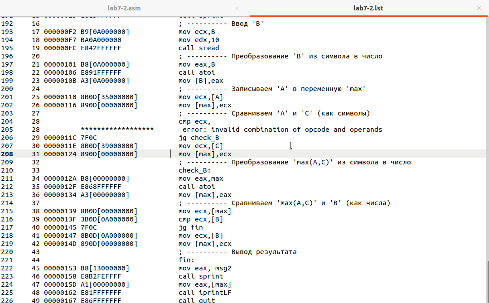{ #fig:011 width=70%, height=70% }

Объектный файл не смог создаться из-за ошибки. Но получился листинг, где выделено место ошибки.

## Выполнение заданий для самостоятельной работы

Напишите программу нахождения наименьшей из 3 целочисленных переменных a,b и c. 
Значения переменных выбрать из табл. 7.5 в соответствии с вариантом, полученным при выполнении лабораторной работы № 6.
Создайте исполняемый файл и проверьте его работу.

Мой вариант 8 - числа: 52,33,40

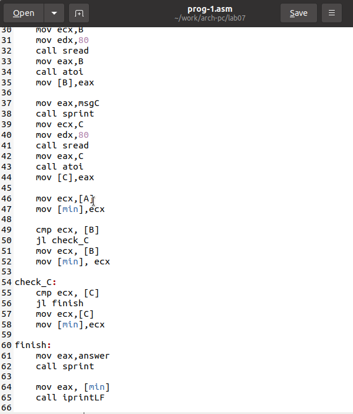{ #fig:012 width=70%, height=70% }

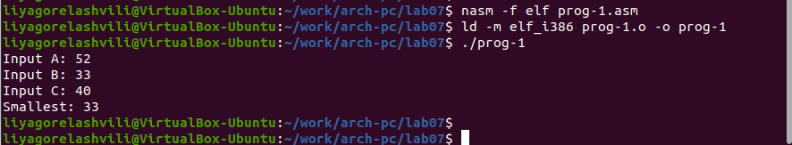{ #fig:013 width=70%, height=70% }

Напишите программу, которая для введенных с клавиатуры значений x и a вычисляет значение заданной функции f(x) и выводит результат вычислений. 
Вид функции f(x) выбрать из таблицы 7.6 вариантов заданий в соответствии с вариантом, полученным при выполнении лабораторной работы № 7. 
Создайте исполняемый файл и проверьте его работу для значений X и a из 7.6. (рис. [-@fig:014]) (рис. [-@fig:015])

Мой вариант 8

$$
 \begin{cases}
	3a, a < 3
	\\   
	x+1, a \ge 3
 \end{cases}
$$

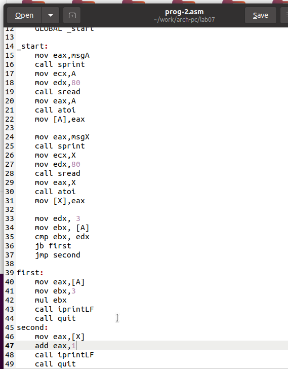{ #fig:014 width=70%, height=70% }

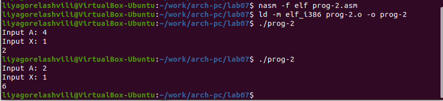{ #fig:015 width=70%, height=70% }

# Выводы

Изучили команды условного и безусловного переходов, познакомились с фалом листинга.