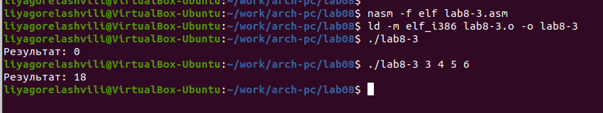
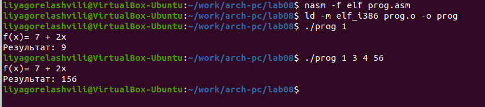

---
## Front matter
title: "Отчёт по лабораторной работе 8"
subtitle: "Архитектура компьютеров и операционные системы"
author: "Горелашвили Лия Михайловна НКАбд-03-23"

## Generic otions
lang: ru-RU
toc-title: "Содержание"

## Bibliography
bibliography: bib/cite.bib
csl: pandoc/csl/gost-r-7-0-5-2008-numeric.csl

## Pdf output format
toc: true # Table of contents
toc-depth: 2
lof: true # List of figures
lot: true # List of tables
fontsize: 12pt
linestretch: 1.5
papersize: a4
documentclass: scrreprt
## I18n polyglossia
polyglossia-lang:
  name: russian
  options:
	- spelling=modern
	- babelshorthands=true
polyglossia-otherlangs:
  name: english
## I18n babel
babel-lang: russian
babel-otherlangs: english
## Fonts
mainfont: PT Serif
romanfont: PT Serif
sansfont: PT Sans
monofont: PT Mono
mainfontoptions: Ligatures=TeX
romanfontoptions: Ligatures=TeX
sansfontoptions: Ligatures=TeX,Scale=MatchLowercase
monofontoptions: Scale=MatchLowercase,Scale=0.9
## Biblatex
biblatex: true
biblio-style: "gost-numeric"
biblatexoptions:
  - parentracker=true
  - backend=biber
  - hyperref=auto
  - language=auto
  - autolang=other*
  - citestyle=gost-numeric
## Pandoc-crossref LaTeX customization
figureTitle: "Рис."
tableTitle: "Таблица"
listingTitle: "Листинг"
lofTitle: "Список иллюстраций"
lotTitle: "Список таблиц"
lolTitle: "Листинги"
## Misc options
indent: true
header-includes:
  - \usepackage{indentfirst}
  - \usepackage{float} # keep figures where there are in the text
  - \floatplacement{figure}{H} # keep figures where there are in the text
---

# Цель работы

Целью работы является приобретение навыков написания программ с использованием циклов и обработкой аргументов командной строки..

# Задание

1. Изучение циклов и стека в ассемблере

2. Изучение процесса передачи аргументов командной строки

3. Рассмотрение примеров с циклами и стеком

4. Выполнение заданий для самостоятельной работы

# Теоретическое введение

Стек — это структура данных, организованная по принципу LIFO («Last In — First Out»
или «последним пришёл — первым ушёл»). Стек является частью архитектуры процессора и
реализован на аппаратном уровне. Для работы со стеком в процессоре есть специальные
регистры (ss, bp, sp) и команды.

Основной функцией стека является функция сохранения адресов возврата и передачи
аргументов при вызове процедур. Кроме того, в нём выделяется память для локальных
переменных и могут временно храниться значения регистров.

Стек имеет вершину, адрес последнего добавленного элемента, который хранится в регистре esp (указатель стека). Противоположный конец стека называется дном. Значение,
помещённое в стек последним, извлекается первым. При помещении значения в стек указатель стека уменьшается, а при извлечении — увеличивается.

Для стека существует две основные операции:

- добавление элемента в вершину стека (push)

- извлечение элемента из вершины стека (pop)

Для организации циклов существуют специальные инструкции. Для всех инструкций
максимальное количество проходов задаётся в регистре ecx. 
Наиболее простой является инструкция loop. Она позволяет организовать безусловный цикл.
Иструкция loop выполняется в два этапа. Сначала из регистра ecx вычитается единица и
его значение сравнивается с нулём. Если регистр не равен нулю, то выполняется переход к
указанной метке. Иначе переход не выполняется и управление передаётся команде, которая
следует сразу после команды loop.

# Выполнение лабораторной работы

## Реализация циклов в NASM

Я создаю папку для выполнения лабораторной работы № 8 и файл с именем lab8-1.asm. 

Стоит отметить, что при использовании команды loop в NASM для реализации 
циклов, необходимо помнить, что эта команда использует регистр ecx в роли 
четчика и на каждом шаге уменьшает его значение на единицу.

Посмотрим на пример программы, которая выводит значение регистра ecx. 
В файл lab8-1.asm я внесла текст программы из листинга 8.1.

{ #fig:001 width=70%, height=70% }

Далее, я создаю исполняемый файл и проверяю его функционирование.

{ #fig:002 width=70%, height=70% }

В этом примере показано, что использование регистра ecx в команде loop 
может привести к неправильному выполнению программы. 
В текст программы я вношу изменения, которые включают в себя изменение 
значения регистра ecx внутри цикла.

{ #fig:003 width=70%, height=70% }

Программа запускает бесконечный цикл при нечетном значении N и 
выводит только нечетные числа при четном значении N.

{ #fig:004 width=70%, height=70% }

Чтобы использовать регистр ecx в цикле и обеспечить правильную работу программы, 
используется стек. Я внесла изменения в текст программы, добавив команды push и 
pop для сохранения значения счётчика цикла loop в стеке.

{ #fig:005 width=70%, height=70% }

Затем был создан исполняемый файл и проверена его работа. 
Программа выводит числа от N-1 до 0, где количество проходов цикла 
соответствует значению N.

{ #fig:006 width=70%, height=70% }

## Обработка аргументов командной строки

Я изучила файл lab8-2.asm, в который внесла код программы из листинга 8.2.

{ #fig:007 width=70%, height=70% }

После этого был создан исполняемый файл, который я запустила с указанными 
аргументами. Программа эффективно обработала пять аргументов, 
которые представляют собой слова или числа, разделенные пробелами.

{ #fig:008 width=70%, height=70% }

Давайте рассмотрим еще один пример программы. Эта программа выводит общую 
сумму чисел, которые были переданы в программу в качестве аргументов 
командной строки.

{ #fig:009 width=70%, height=70% }

{ #fig:010 width=70%, height=70% }

Я внесла изменения в код программы из листинга 8.3 с целью расчета произведения аргументов командной строки.

{ #fig:011 width=70%, height=70% }

{ #fig:012 width=70%, height=70% }

## Выполнение заданий для самостоятельной работы

Напишите программу, которая находит сумму значений функции 
$f(x)$ для $x = x_1, x_2, ..., x_n$, т.е. программа должна выводить значение 
$f(x_1) + f(x_2)+ ... +f(x_n)$. 
Значения $x$ передаются как аргументы. 
Вид функции $f(x)$ выбрать из таблицы 8.1 вариантов заданий в соответствии с вариантом, 
полученным при выполнении лабораторной работы № 7. 
Создайте исполняемый файл и проверьте его работу на нескольких наборах $x$.

Мой вариант 8: $f(x) = 7 + 2x$ 

{ #fig:013 width=70%, height=70% }

{ #fig:014 width=70%, height=70% }

# Выводы

Освоили работу со стеком, циклом и аргументами на ассемблере nasm.