---
## Front matter
title: "Отчёт по лабораторной работе 9"
subtitle: "Архитектура компьютеров и операционные системы"
author: "Горелашвили Лия Михайловна НКАбд-03-23"

## Generic otions
lang: ru-RU
toc-title: "Содержание"

## Bibliography
bibliography: bib/cite.bib
csl: pandoc/csl/gost-r-7-0-5-2008-numeric.csl

## Pdf output format
toc: true # Table of contents
toc-depth: 2
lof: true # List of figures
lot: true # List of tables
fontsize: 12pt
linestretch: 1.5
papersize: a4
documentclass: scrreprt
## I18n polyglossia
polyglossia-lang:
  name: russian
  options:
	- spelling=modern
	- babelshorthands=true
polyglossia-otherlangs:
  name: english
## I18n babel
babel-lang: russian
babel-otherlangs: english
## Fonts
mainfont: PT Serif
romanfont: PT Serif
sansfont: PT Sans
monofont: PT Mono
mainfontoptions: Ligatures=TeX
romanfontoptions: Ligatures=TeX
sansfontoptions: Ligatures=TeX,Scale=MatchLowercase
monofontoptions: Scale=MatchLowercase,Scale=0.9
## Biblatex
biblatex: true
biblio-style: "gost-numeric"
biblatexoptions:
  - parentracker=true
  - backend=biber
  - hyperref=auto
  - language=auto
  - autolang=other*
  - citestyle=gost-numeric
## Pandoc-crossref LaTeX customization
figureTitle: "Рис."
tableTitle: "Таблица"
listingTitle: "Листинг"
lofTitle: "Список иллюстраций"
lotTitle: "Список таблиц"
lolTitle: "Листинги"
## Misc options
indent: true
header-includes:
  - \usepackage{indentfirst}
  - \usepackage{float} # keep figures where there are in the text
  - \floatplacement{figure}{H} # keep figures where there are in the text
---

# Цель работы

Целью работы является приобретение навыков написания программ с использованием подпрограмм.
Знакомство с методами отладки при помощи GDB и его основными возможностями.

# Задание

1. Изучение подпрограмм в ассемблере

2. Освоение возможностей отладчика GDB

3. Рассмотрение примеров работы с отладчиком

4. Выполнение заданий для самостоятельной работы

# Теоретическое введение

GDB (GNU Debugger — отладчик проекта GNU) работает на многих UNIX-подобных
системах и умеет производить отладку многих языков программирования. GDB предлагает
обширные средства для слежения и контроля за выполнением компьютерных программ. Отладчик не содержит собственного графического пользовательского интерфейса и использует
стандартный текстовый интерфейс консоли. Однако для GDB существует несколько сторонних графических надстроек, а кроме того, некоторые интегрированные среды разработки
используют его в качестве базовой подсистемы отладки.

Подпрограмма — это, как правило, функционально законченный участок кода, который
можно многократно вызывать из разных мест программы. В отличие от простых переходов
из подпрограмм существует возврат на команду, следующую за вызовом.
Если в программе встречается одинаковый участок кода, его можно оформить в виде
подпрограммы, а во всех нужных местах поставить её вызов. При этом подпрограмма будет содержаться в коде в одном экземпляре, что позволит уменьшить размер кода всей
программы.

Для вызова подпрограммы из основной программы используется инструкция call, которая заносит адрес следующей инструкции в стек и загружает в регистр eip адрес соответствующей подпрограммы, осуществляя таким образом переход. Затем начинается выполнение
подпрограммы, которая, в свою очередь, также может содержать подпрограммы.

Подпрограмма завершается инструкцией ret, которая извлекает из стека адрес, занесённый туда соответствующей инструкцией call, и заносит его в eip. После этого выполнение
основной программы возобновится с инструкции, следующей за инструкцией call.

# Выполнение лабораторной работы

## Реализация подпрограмм в NASM

Для начала я создала новую директорию и перешла в нее, чтобы выполнить 
лабораторную работу номер 9. Затем создала файл с именем lab9-1.asm, 
в котором реализовала программу для вычисления арифметического 
выражения f(x) = 2x + 7 с использованием подпрограммы calcul. 
Для этого я вводила значение переменной x с клавиатуры, 
а само выражение вычислялось внутри подпрограммы.

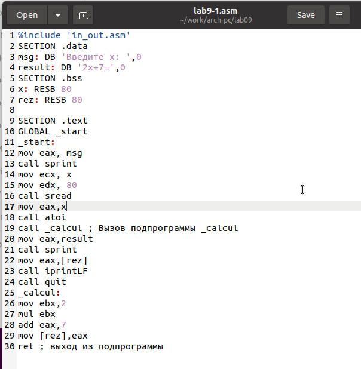{ #fig:001 width=70%, height=70% }

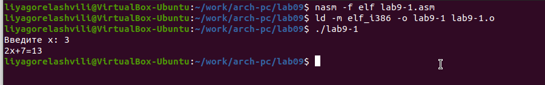{ #fig:002 width=70%, height=70% }

После этого я внесла изменения в текст программы, добавив подпрограмму 
subcalcul внутрь подпрограммы calcul. Это позволяет вычислить составное 
выражение f(g(x)), где значение x также вводится с клавиатуры. Функции 
определены следующим образом: f(x) = 2x + 7, g(x) = 3x - 1.

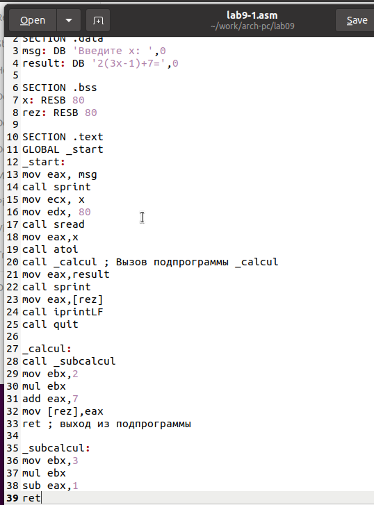{ #fig:003 width=70%, height=70% }

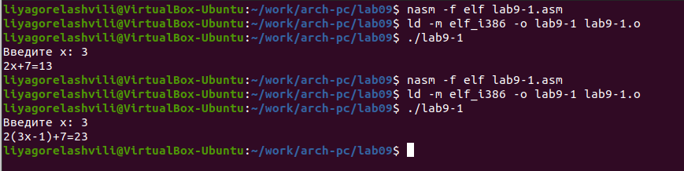{ #fig:004 width=70%, height=70% }

## Отладка программам с помощью GDB

Также я создала файл с именем lab9-2.asm, в котором содержится программа 
для вывода сообщения "Hello world!". Я скомпилировала этот файл и получила 
исполняемый файл. Чтобы добавить отладочную информацию 
для работы с отладчиком GDB, я использовала ключ "-g".

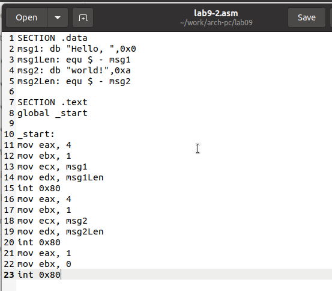{ #fig:005 width=70%, height=70% }

Затем я загрузила полученный исполняемый файл в отладчик GDB и проверила его 
работу, запустив программу с помощью команды "run" или "r". Чтобы получить 
более детальный анализ программы, я установила точку остановки на метке 
"start", с которой начинается выполнение любой ассемблерной программы, 
и запустила ее. После этого я просмотрела дизассемблированный код программы.

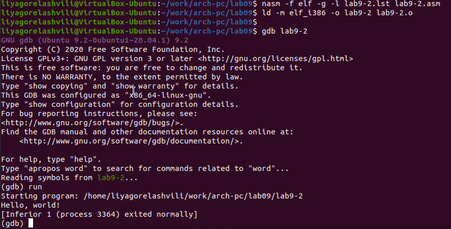{ #fig:006 width=70%, height=70% }

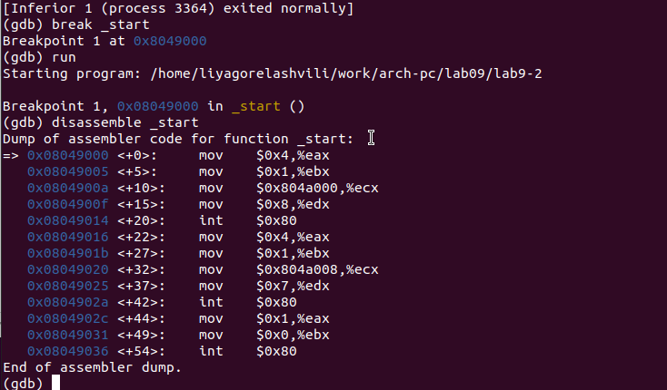{ #fig:007 width=70%, height=70% }

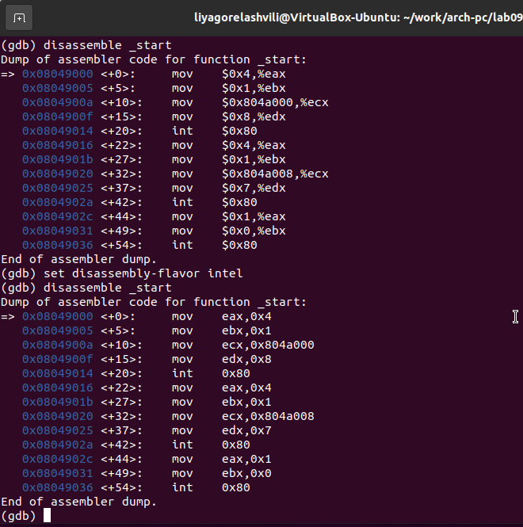{ #fig:008 width=70%, height=70% }

Для проверки точки остановки по имени метки "_start" я воспользовалась командой 
"info breakpoints" или "i b". Кроме того, я установила еще одну точку 
остановки по адресу инструкции, определив адрес предпоследней инструкции 
"mov ebx, 0x0". Это помогло мне контролировать выполнение программы и 
анализировать ее состояние в отладчике GDB.

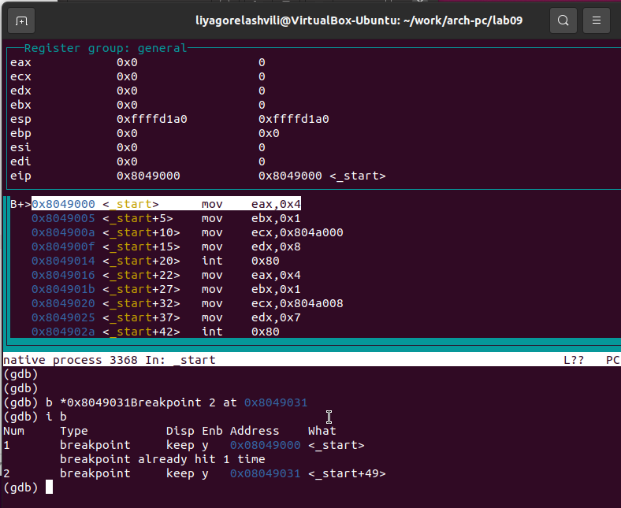{ #fig:009 width=70%, height=70% }

В GDB я имею возможность просматривать содержимое ячеек памяти и регистров, 
а также изменять значения регистров и переменных. 
Для отслеживания изменений значений регистров, использовала команду 'stepi' 
(сокращенно 'si'), которая позволяет выполнить одну инструкцию за раз. 
Это позволило мне следить за состоянием программы и анализировать изменения 
регистров.

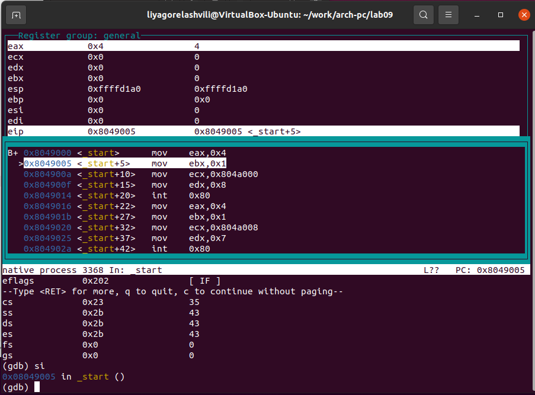{ #fig:010 width=70%, height=70% }

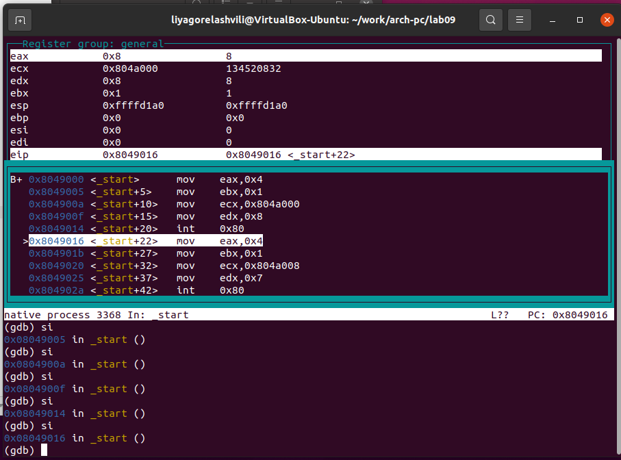{ #fig:011 width=70%, height=70% }

Для просмотра значения переменной msg1 по имени и получения нужных данных, 
использовала соответствующую команду, предоставленную отладчиком GDB.

Еще одной полезной командой была команда set, которую я 
использовала для изменения значения регистра или ячейки памяти. 
Я указывала имя регистра или адрес в качестве аргумента команды set, 
и успешно изменяла значения переменных и регистров в процессе отладки программы.

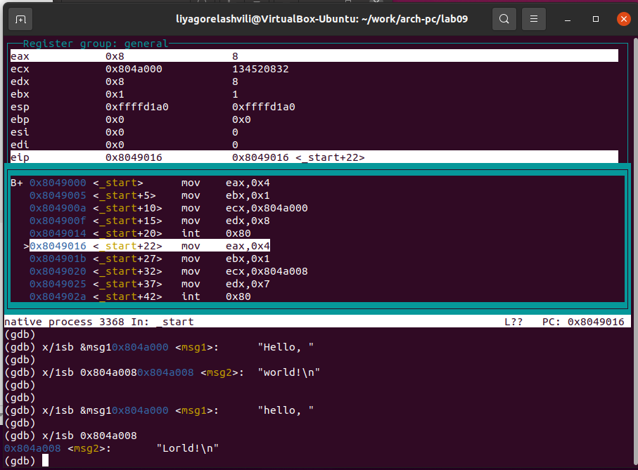{ #fig:012 width=70%, height=70% }

В частности, я успешно изменила первый символ переменной msg1, что 
позволило мне проверить поведение программы при изменении данных.

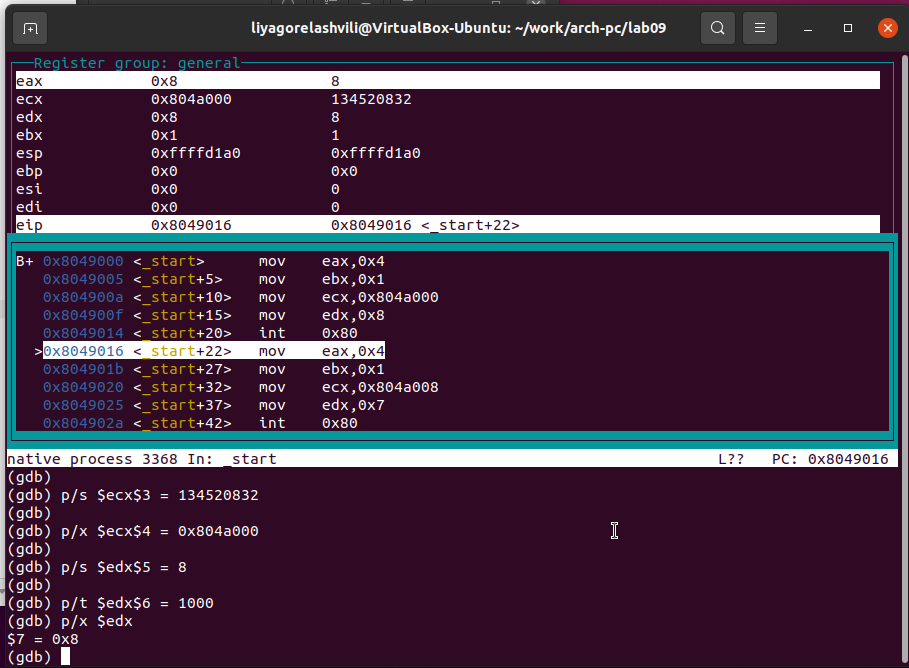{ #fig:013 width=70%, height=70% }

Также, с помощью команды set, я изменяла значение регистра ebx на нужное значение, 
чтобы проверить влияние такой модификации на выполнение программы.

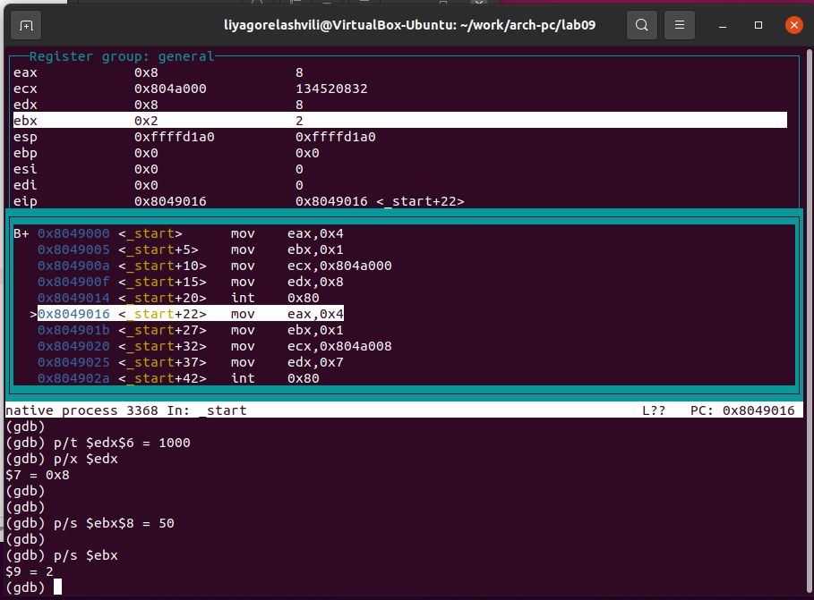{ #fig:014 width=70%, height=70% }

Для выполнения лабораторной работы, я решила использовать файл lab8-2.asm, 
который был создан в процессе выполнения предыдущей лабораторной работы №8. 
Этот файл содержит программу, которая выводит аргументы командной строки. 
Для начала, я скопировала этот файл и создала исполняемый файл из скопированного 
исходного файла.

Для загрузки программы с аргументами в отладчик GDB, я использовала ключ --args 
и загрузила исполняемый файл в отладчик с указанными аргументами. Затем, 
установила точку останова перед первой инструкцией программы и запустила ее.

В процессе отладки, я обратила внимание на адрес вершины стека, который 
хранится в регистре esp. По этому адресу, обнаружила число, указывающее 
количество аргументов командной строки. В данном случае, количество аргументов 
равно 5, включая имя программы lab9-3 и аргументы: аргумент1, аргумент2 и 
'аргумент 3'.

Далее, я просмотрела остальные позиции стека. По адресу [esp+4], нашла адрес 
в памяти, где располагается имя программы. По адресу [esp+8] хранится адрес 
первого аргумента, по адресу [esp+12] - второго, и так далее. 
Шаг изменения адреса равен 4 байта, так как каждый следующий адрес 
на стеке находится на расстоянии 4 байт от предыдущего 
([esp+4], [esp+8], [esp+12]).

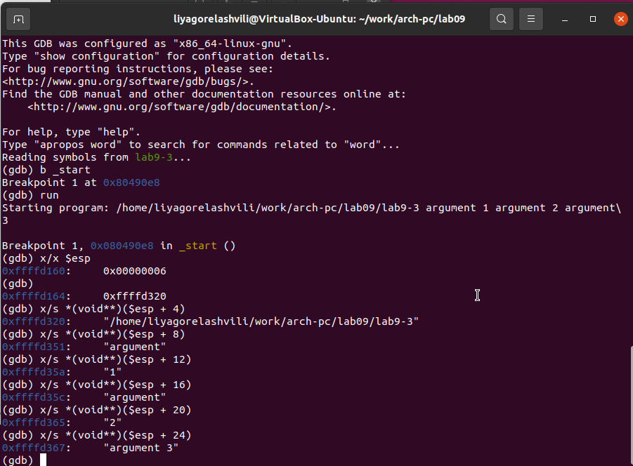{ #fig:015 width=70%, height=70% }

## Задание для самостоятельной работы

Я переписала программу из лабораторной работы №8, задание №1, 
чтобы реализовать вычисление значения функции f(x) как подпрограмму.

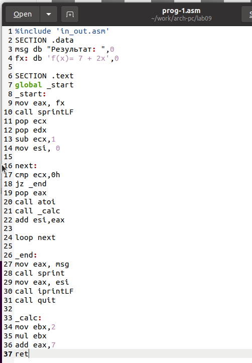{ #fig:016 width=70%, height=70% }

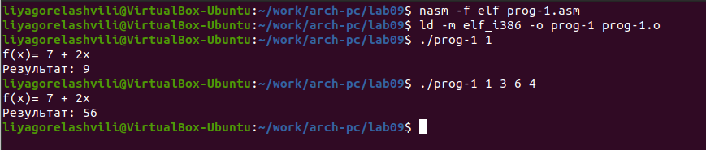{ #fig:017 width=70%, height=70% }

Приведенный ниже код представляет программу для вычисления выражения $(3+2)*4+5$. 
Однако, при запуске, программа дает неверный результат.

Я провела анализ изменений значений регистров с помощью отладчика GDB 
и обнаружила ошибку: перепутан порядок аргументов у инструкции add. 
Также заметила, что по окончании работы программы в регистр edi передается 
значение ebx вместо eax.

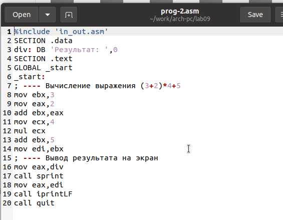{ #fig:018 width=70%, height=70% }

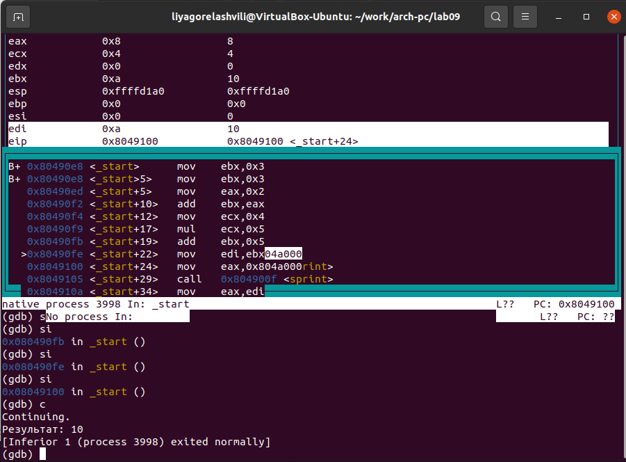{ #fig:019 width=70%, height=70% }

Я внесла необходимые исправления в код программы, учитывая перепутанный 
порядок аргументов у инструкции add и правильную передачу значения в регистр 
edi по окончании работы программы. Это позволило исправить ошибку и получить 
правильный результат вычисления выражения.

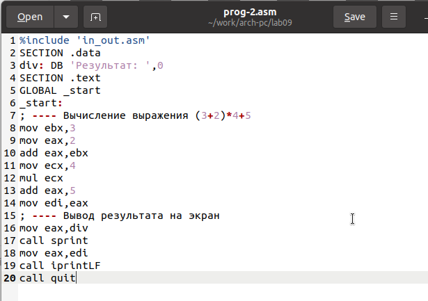{ #fig:020 width=70%, height=70% }

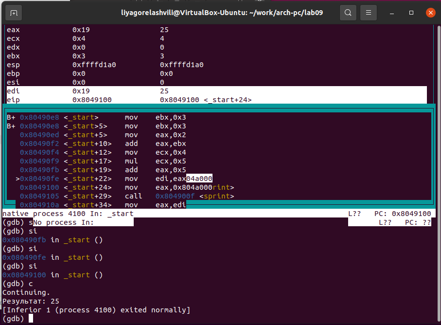{ #fig:021 width=70%, height=70% }

# Выводы

Освоили работy с подпрограммами и отладчиком.